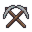
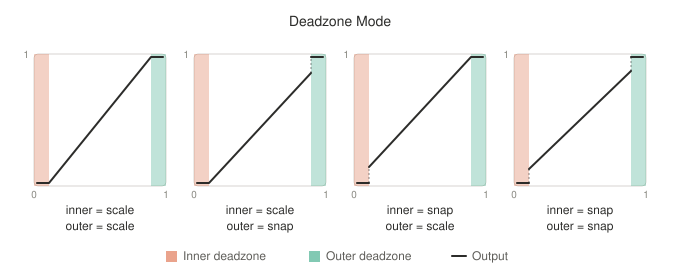
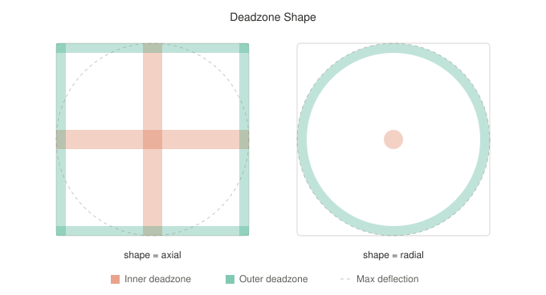
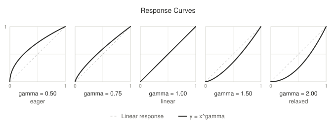
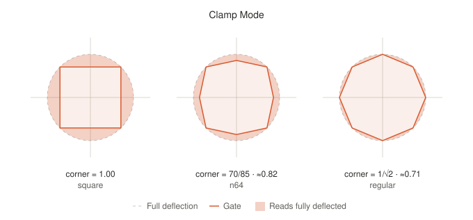
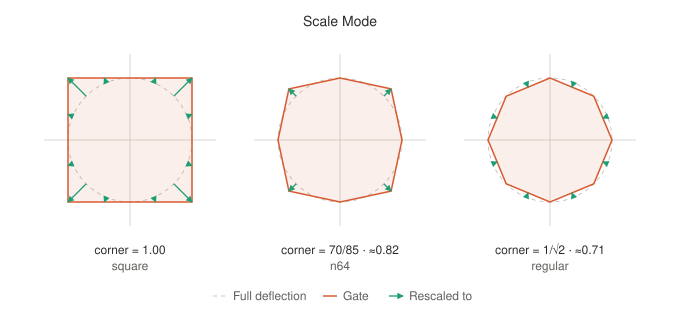
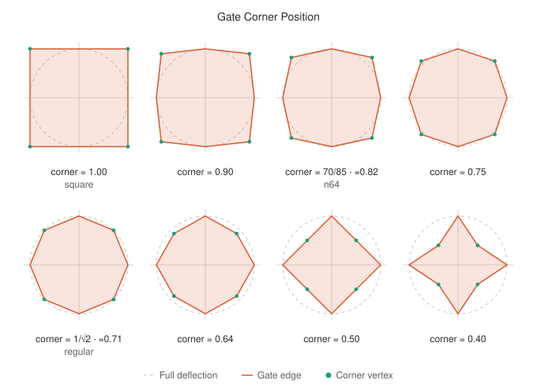

<h1 align="center">
  
  Pickaxes
</h1>
<p align="center"><em>Input calibration and shaping for sticks and triggers on 32-bit microcontrollers</em></p>

## Features

- [Calibration](#calibration) for sticks and triggers
- Inner and outer [deadzones](#deadzones) - axial/radial, scaled/position true
- Gamma [response curves](#response-curves) for sensitivity tuning
- [Virtual gates](#virtual-gates) - circular, square, octagonal
- Plain, portable C99 with no dependencies
- No dynamic allocation, no global state
- Integer-only math, no FPU required

## Overview

Game controllers typically have many analog inputs, such as sticks and triggers. When building a custom controller, those inputs can come from anywhere, sometimes salvaged from other systems, and sometimes even designed from scratch. Pickaxes lets you tune the feel of each input, either for personal preference, or to match the feel of an original controller.

Pickaxes transforms raw ADC values based on two layers of configuration, [*calibration*](#calibration) and [*shaping*](#shaping). Calibration describes the physical properties of each input, such as its orientation and range, while shaping can be tuned by the user to adjust the precise shape and feel of the output.

Pickaxes splits the work into three stages, keeping the expensive parts out of the polling loop as much as possible.

1. **Configure** happens elsewhere, for example in a homebrew app running on the console. Your firmware just stores the calibration and shaping it is handed, and passes them to Pickaxes, which keeps nothing itself.
2. **Derive** combines the stored calibration and shaping into a *transform*, a small set of precomputed scales and clamps. Run it at boot, and again whenever calibration or shaping changes.
3. **Apply** runs the transform on each raw reading, every poll.

Pickaxes works with any ADC resolution up to 16-bit. Output is normalized, with sticks spanning ±`AXES_FULL_SCALE` on each axis, and triggers `0` to `AXES_FULL_SCALE`.

## Installation

Compile `src/axes.c`, add `include/` to your include path, and include `<axes/axes.h>`.

## Example

This example demonstrates shaping a generic stick with circular physical gate, read from a 12-bit ADC channel, to feel/act like an OEM N64 stick:

```c
#include <axes/axes.h>

#define N64_STICK_FULL_SCALE 85

// Sample calibration for a stick on a 12-bit ADC, measured during setup
struct axes_stick_calibration calibration = {
  .rest_x = 2052, .rest_y = 2071,
  .min_x  = 214,  .min_y  = 189,
  .max_x  = 3888, .max_y  = 3907,
};

// Shaping for an OEM N64 feel, with a small deadzone
struct axes_stick_shaping shaping = {
  .deadzone_inner   = AXES_FULL_SCALE * 0.05,
  .deadzone_outer   = AXES_FULL_SCALE * 0.02,
  .deadzone_shape   = AXES_DEADZONE_SHAPE_RADIAL,
  .deadzone_mode    = AXES_DEADZONE_MODE_SCALED,
  .response_gamma   = AXES_GAMMA_LINEAR,
  .gate_shape       = AXES_GATE_SHAPE_OCTAGON,
  .gate_corner      = AXES_OCTAGON_N64,
  .gate_mode        = AXES_GATE_MODE_SCALE,
};

// Combine calibration and shaping into a transform
struct axes_stick_transform transform;
axes_stick_derive(&transform, &calibration, &shaping);

// Apply the transform to each raw reading
while (true) {
  int16_t x, y;
  axes_stick_apply(&transform, adc_read(PIN_SX), adc_read(PIN_SY), &x, &y);

  // Scale to the ±85 range of an OEM N64 stick
  int8_t n64_x = (int32_t)x * N64_STICK_FULL_SCALE / AXES_FULL_SCALE;
  int8_t n64_y = (int32_t)y * N64_STICK_FULL_SCALE / AXES_FULL_SCALE;

  // ...send n64_x and n64_y down the wire, and whatever else in your main loop
}
```

## Calibration

Calibration describes the physical properties of each input, such as its orientation and range. You'd typically capture these values by running through a "calibration wizard" in a standalone app, and send the results back to your firmware over the wire.

### Stick Calibration

Pickaxes requires the resting position, mounting orientation, and range of travel of each stick:

```c
struct axes_stick_calibration {
  uint16_t rest_x,    rest_y;    // Raw ADC reading when released
  uint16_t min_x,     min_y;     // Minimum raw ADC reading
  uint16_t max_x,     max_y;     // Maximum raw ADC reading
  bool     invert_x,  invert_y;  // Axis is inverted
  bool     swap_xy;              // Stick is mounted at 90 degrees
};
```

A good way to capture these is to prompt the user to release the stick and record `rest_x` and `rest_y`, then push it to each cardinal in turn, recording the reading at each. Rotating the stick slowly around its full travel 2-3 times, while sampling continuously, captures `min` and `max` reliably, though the cardinal readings alone are probably good enough if the stick is mounted at a 90-degree increment.

You don't need to work out the orientation flags yourself. With the resting position already recorded, you can use `axes_stick_calibration_orient()` to fill in `swap_xy`, `invert_x`, and `invert_y` from the readings at the up and right cardinals.

### Trigger Calibration

Pickaxes requires the resting and fully-pressed extents of each trigger:

```c
struct axes_trigger_calibration {
  uint16_t rest;     // Raw ADC reading when released
  uint16_t pressed;  // Raw ADC reading when fully pressed
};
```

A good way to capture these is to prompt the user to release the trigger and record `rest`, then press it all the way and record `pressed`.

There is no need to specify an orientation, since it can be determined automatically from the `rest` and `pressed` readings.

## Shaping

Shaping is tuned by the user, and applies on top of the already-calibrated signal. Sticks are shaped with `struct axes_stick_shaping`, and triggers with `struct axes_trigger_shaping`.

### Deadzones

A deadzone is a region of travel where movement is ignored. The *inner* deadzone covers the resting position, where everything reads as no input at all. This can help account for ADC readings that wander a little from sample to sample, and from drift as hardware ages or warms up. The *outer* deadzone is the same idea at the far end of travel, where input reads as fully deflected, so an input that struggles to reach its calibrated extents can still hit full output.

#### Deadzone Sizes

Deadzone sizes are set with `deadzone_inner` and `deadzone_outer`. The inner deadzone extends outward from the resting position, and the outer deadzone extends inward from full deflection. A 10% deadzone would be `AXES_FULL_SCALE * 0.1`.

#### Deadzone Mode

The `deadzone_mode` decides what happens when input leaves the deadzone:

- `AXES_DEADZONE_MODE_UNSCALED` - passes input through unchanged, so output matches physical position exactly, at the cost of a jump as the input leaves the zone
- `AXES_DEADZONE_MODE_SCALED` - stretches the remaining travel to cover the full range, so output rises from zero

<picture>
  <source media="(prefers-color-scheme: dark)" srcset="images/deadzone-mode-dark.svg">
  <source media="(prefers-color-scheme: light)" srcset="images/deadzone-mode-light.svg">
  
</picture>

#### Deadzone Shape

For sticks, the `deadzone_shape` decides which area of the stick's travel is considered deadzone:

- `AXES_DEADZONE_SHAPE_AXIAL` - a separate band applied to each axis independently
- `AXES_DEADZONE_SHAPE_RADIAL` - a circle applied to the stick's distance from center

<picture>
  <source media="(prefers-color-scheme: dark)" srcset="images/deadzone-shape-dark.svg">
  <source media="(prefers-color-scheme: light)" srcset="images/deadzone-shape-light.svg">
  
</picture>

### Response Curves

A response curve is set with `response_gamma`, a single exponent applied to the normalized magnitude after deadzones, which for a stick is its distance from rest rather than each axis. It bends the output's ramp, trading sensitivity near rest against sensitivity at the far end of travel. This is most useful for sensors that are not linear to begin with, such as home-made Hall effect triggers, which read magnetic field strength rather than travel and so compress toward one end.

- `1.0` - linear, output tracks physical travel
- `< 1.0` - eager, output rises quickly off rest, then flattens out
- `> 1.0` - relaxed, output rises slowly off rest for fine control, then ramps to full

Gamma is stored as Q8.8 fixed point, where `AXES_GAMMA_LINEAR` is exactly 1.0, so a curve of 1.5 is `1.5 * AXES_GAMMA_LINEAR`.

<picture>
  <source media="(prefers-color-scheme: dark)" srcset="images/response-curves-dark.svg">
  <source media="(prefers-color-scheme: light)" srcset="images/response-curves-light.svg">
  
</picture>

### Virtual Gates

Sticks have a physical gate, the shaped opening in a controller's shell or in the stick itself that bounds their travel, and it is typically a circle. A virtual gate gives the output a different shape, either by clamping travel at the new boundary or scaling travel onto it.

#### Gate Shape

The desired output shape of the gate is chosen with `gate_shape`:

- `AXES_GATE_SHAPE_NONE` - no reshaping, each axis clamped to full scale independently
- `AXES_GATE_SHAPE_CIRCLE` - full scale at the cardinals, with a round edge between them
- `AXES_GATE_SHAPE_OCTAGON` - an octagon with tunable corner positions

#### Gate Mode

The way travel is applied to that shape is chosen with `gate_mode`:

- `AXES_GATE_MODE_CLAMP` - treats the virtual gate as a physical restriction, so output tracks position exactly until the stick meets the boundary, then holds there
- `AXES_GATE_MODE_SCALE` - rescales the whole travel onto the gate instead, so the cardinals always reach full scale

<picture>
  <source media="(prefers-color-scheme: dark)" srcset="images/gate-clamp-dark.svg">
  <source media="(prefers-color-scheme: light)" srcset="images/gate-clamp-light.svg">
  
</picture>

<picture>
  <source media="(prefers-color-scheme: dark)" srcset="images/gate-scale-dark.svg">
  <source media="(prefers-color-scheme: light)" srcset="images/gate-scale-light.svg">
  
</picture>

Clamping keeps output matched to where the stick actually is, at the cost of travel between the gate and the rim reading as fully deflected. Scaling uses all of the travel instead, at the cost of output no longer matching position.

#### Gate Corner Position

An octagon's shape is set by a single value, `gate_corner`, which is where its diagonal corners sit relative to full scale. Sweeping it pulls the corners inward, morphing the gate from a square, through a regular octagon, down to a diamond and beyond.

<picture>
  <source media="(prefers-color-scheme: dark)" srcset="images/gate-corner-dark.svg">
  <source media="(prefers-color-scheme: light)" srcset="images/gate-corner-light.svg">
  
</picture>

Presets are provided for some useful shapes that can be achieved with an octagon gate:

- `AXES_OCTAGON_SQUARE` - corners at full scale on both axes, forming a square
- `AXES_OCTAGON_REGULAR` - corners on the full-scale circle, a regular octagon
- `AXES_OCTAGON_N64` - corners pushed outside the circle, matching an OEM N64 gate

For other octagonal shapes, corner positions use the same normalized scale as everything else, where `AXES_FULL_SCALE` is a full cardinal deflection. A gate with corners measured at 0.76 of full deflection is `AXES_FULL_SCALE * 0.76`. A corner position of zero is treated as `AXES_OCTAGON_REGULAR`.

## License

Pickaxes is released under the MIT license. See [LICENSE](LICENSE).
